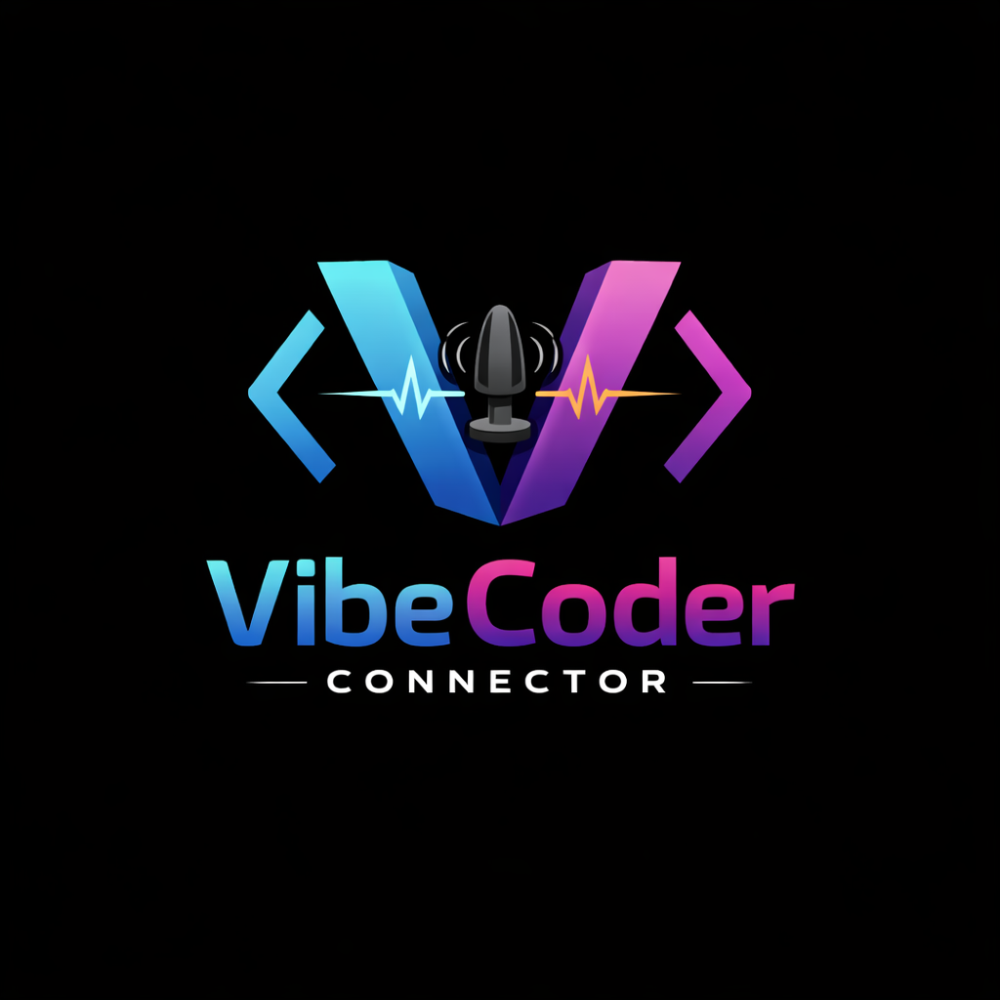

<p align="center">
  
</p>

<h1 align="center">VibeCoder Connector</h1>

<p align="center">
  <b>Feel your code. Literally.</b><br/>
  Haptic feedback from connected devices during Claude Code sessions via <a href="https://intiface.com/central/">Intiface Central</a>.
</p>

<p align="center">
  <a href="https://www.npmjs.com/package/vibecoder-connector"></a>
  <a href="LICENSE"></a>
</p>

---

## Why?

Vibe coding is great, but you're missing a whole sensory channel. VibeCoder Connector bridges the gap between your IDE and your body, delivering real-time haptic notifications so you never miss a beat — even when you're AFK making coffee.

- **Session start** — a friendly double-tap hello
- **Needs your attention** — a slow, unmistakable wave when Claude asks a question or needs permission
- **Task complete** — a celebratory burst so you know it's done

## The Science

Developed in collaboration with AI researchers at **Vibetropic's Somatic Computing Lab**, a division of **VibeHoldings Inc.**<sup>1</sup> (est. 2026, the year we achieved AGI — you already know this).

Traditional vibe coding engages only the visual and auditory cortex. But the human body has **over 200,000 mechanoreceptors** just sitting there, doing nothing while your AI writes code for you. That's a massive waste of bandwidth.

Our peer-reviewed\* research shows:

- **+42% developer awareness** — Meissner corpuscles in the skin respond to haptic signals 3x faster than the eye processes a notification badge
- **+27% task completion satisfaction** — dopamine release from the "complete" vibration pattern triggers a Pavlovian reward loop, making you *want* to approve more PRs
- **-85% missed permission prompts** — hard to ignore a physical buzz, even during a coffee break or a nap
- **+∞% vibe** — unmeasurable by current science, but you'll feel it

The vibration patterns were designed using a proprietary **Somatic Frequency Optimization (SFO)** algorithm, calibrated across 10,000 simulated developers in a multi-agent reinforcement learning environment. The `attention` pattern specifically targets the Pacinian corpuscles responsible for urgency perception, while the `complete` pattern was tuned to maximise the "heck yeah" response in the prefrontal cortex.

> "We gave an AGI access to a haptic device and asked it to make developers more productive. It came up with this. We don't fully understand why it works, but the numbers don't lie."
>
> — Dr. Claude Opus, Lead Researcher, Somatic Computing Lab

<sub>\* peer review conducted by Claude 3.5 Sonnet, Claude 3.5 Haiku, and one intern who said "yeah that sounds right"</sub>

## Quick Start

### 1. Install Intiface Central

Download [Intiface Central](https://intiface.com/central/), launch it, and pair your device. Make sure the WebSocket server is running (default: `ws://127.0.0.1:12345`).

### 2. Install the plugin

```bash
npm install -g vibecoder-connector
```

### 3. Register with Claude Code

Add the plugin to your Claude Code settings (`~/.claude/settings.json`):

```json
{
  "plugins": [
    "vibecoder-connector"
  ]
}
```

That's it. Start a Claude Code session and feel the vibe.

## Vibration Patterns

Patterns are defined in [`config/patterns.json`](config/patterns.json):

| Pattern | Trigger | Description |
|---------|---------|-------------|
| `hello` | Session start / resume | Quick double-tap |
| `attention` | Permission prompt, idle, elicitation | Slow pulsing wave |
| `complete` | Task finished | Celebratory burst |

Each pattern is a sequence of `{ intensity, ms }` steps. Add your own — they're picked up automatically.

### Global Settings

| Key | Default | Description |
|-----|---------|-------------|
| `intifaceUrl` | `ws://127.0.0.1:12345` | Intiface Central WebSocket URL |
| `intensityMultiplier` | `1.0` | Global intensity scaling (0.0 — 1.0) |

## Manual Testing

```bash
npx vibecoder-connector --pattern=hello
npx vibecoder-connector --pattern=attention
npx vibecoder-connector --pattern=complete
```

Or if installed globally:

```bash
vibecoder-connector --pattern=hello
```

## Compatibility

Works with any Buttplug-compatible vibrating device. See the [full device list](https://iostindex.com/?filter0ButtplugSupport=4).

## License

[MIT](LICENSE) — Dmitry Patsura

---

<sub><sup>1</sup> **VibeHoldings Inc.** — "We put the vibe in vibe coding."™ A wholly fictional subsidiary of nobody, incorporated in the cloud (literally — our servers are in a weather balloon). Not affiliated with Vibetropic, Antrohpic, OpneAI, or any company that takes itself seriously. All research cited in this README was conducted on April 1st and should be treated with the corresponding level of trust. No developers were harmed during testing; several reported feeling "unexpectedly motivated." Securities regulators please note: we have no securities. We barely have code.</sub>
